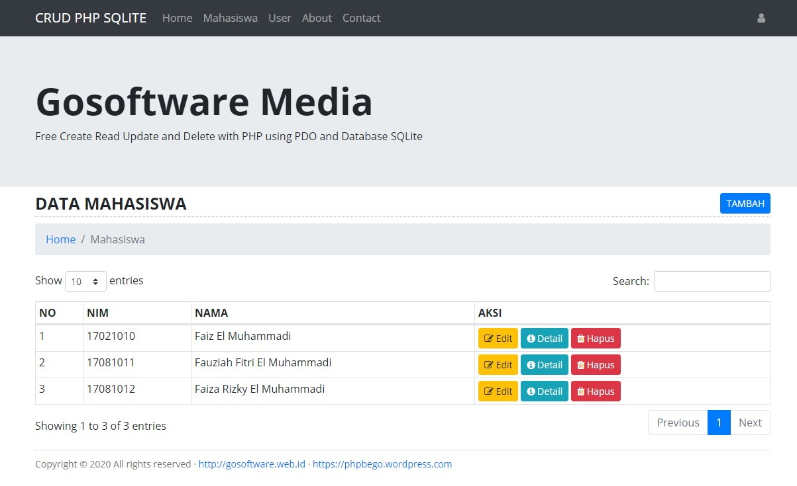

# CRUD PHP SQLite
Simple Create Read Update and Delete with PHP using PDO and Database SQLite

## Update
1. Composer Ready
2. PHP 7.4.x Ready
3. Simple Router
4. Bootstrap 4.5.2
5. DataTables 1.10.21
6. jQuery v3.5.1
7. Font Awesome 4.7.0

## Installation
```sh
git clone https://github.com/suendri/free-crud-php-sqlite.git
composer install
https://localhost/free-crud-php-sqlite/db/install.php
set RewriteBase on .htaccess based on folder name
```
## Donation
Please read DONASI.txt

## Screenshot
